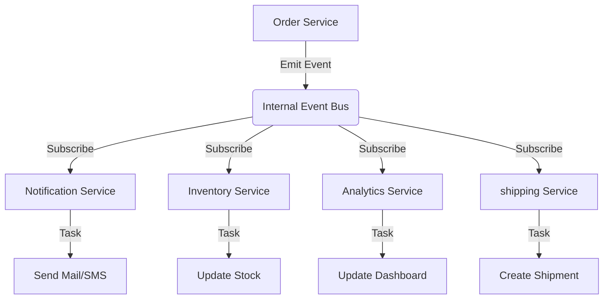

# TASK-222: Điều phối Bất đồng bộ: Vòng đời Đơn hàng & Sự kiện (Asynchronous Coordination: Order Lifecycle & Event Orchestration)

## 📋 Metadata

- **Task ID**: TASK-222
- **Độ ưu tiên**: 🔴 CAO (Architecture & Scalability)
- **Phụ thuộc**: TASK-209 (Order Creation), TASK-221 (Payments)
- **Trạng thái**: ⏳ Not started

---

## 📌 Scope note (MVP, chốt qua grill-with-docs 2026-07-15)

Sau khi grill lại thiết kế gốc với thực trạng codebase, scope MVP thu hẹp đáng kể so với bản gốc bên dưới:

- **Chỉ build 1 listener: Notification** (structured-log placeholder, chưa gửi email thật — email thật là TASK-124/Phase D, chưa build). **Bỏ Inventory** (đã trừ/hoàn kho đồng bộ trong transaction, TASK-210), **bỏ Analytics** (audit đã có `OrderStateChangeLog` đồng bộ; stats TASK-211 query trực tiếp Order/OrderItem, cố tình không denormalize), **bỏ Shipping** (chưa có module logistics nào trong repo).
- **Không lắng nghe `order.force-status-changed`** — coi là thao tác support nội bộ, không tự động notify khách.
- **Delivery at-most-once**, không phải queue bền — xem [ADR-0003](../../../adr/0003-notification-listener-at-most-once.md). Scenario "Retry Logic" ở bảng TDD bên dưới **không áp dụng**, bỏ khỏi acceptance criteria thực tế.
- **Không cần idempotency guard** ở listener — state machine (`isValidOrderTransition`) đã đảm bảo 1 transition chỉ emit đúng 1 lần, không có nguy cơ emit trùng.
- **Module riêng `src/modules/notification/`** — không gộp vào `order/` — vì hạ tầng email dùng chung cho cả TASK-124 (account verification/forgot-password) sau này.
- Listener query lại Order + User từ DB để log đầy đủ ngữ cảnh (order number, email, trạng thái mới) — tập dượt đúng shape của việc gửi email thật sau này.

**Acceptance criteria thực tế cho MVP** (thay thế toàn bộ "TIÊU CHUẨN THÀNH CÔNG" + bảng TDD gốc bên dưới):

1. Mỗi 1 trong 5 event (`order.paid/shipped/delivered/cancelled/refunded`) → `NotificationListener` query lại Order+User, log 1 dòng chứa order number, email, trạng thái mới.
2. Listener throw lỗi (vd Order/User bị xóa giữa chừng) → không crash request gốc (`@OnEvent` mặc định `suppressErrors: true`), response vẫn trả bình thường cho client.

Phần bên dưới là **spec gốc trước khi grill** — giữ lại để tham khảo ngữ cảnh/lý do ban đầu, không còn là acceptance criteria hiện hành.

---

## 🎯 CHIẾN LƯỢC SỰ KIỆN (Event-Driven Strategy)

### 💡 Tại sao Điều phối bằng Sự kiện quan trọng?

Một đơn hàng từ lúc được tạo đến khi giao thành công phải trải qua rất nhiều bước: Thanh toán, Trừ kho, Email thông báo, Điều phối vận chuyển. Nếu gộp tất cả code này vào 1 hàm duy nhất, hệ thống sẽ trở nên chậm chạp và cực kỳ khó bảo trì. Kiến trúc hướng sự kiện (Event-Driven) giúp tách biệt các trách nhiệm này.

- **Decoupling**: Module Order không cần biết module Email hay module Logistics làm gì. Nó chỉ cần "phát loa" thông báo sự kiện.
- **System Scalability**: Dễ dàng thêm các tính năng mới (ví dụ: Tặng điểm thưởng khi mua hàng) mà không cần sửa code cũ của module Order.
- **Reliability**: Các tác vụ nặng (như gửi email) được xử lý bất đồng bộ, giúp API phản hồi khách hàng nhanh nhất có thể.

---

## 🏗️ LUỒNG ĐIỀU PHỐI SỰ KIỆN (Event Delivery Flow)

---

## 📄 QUY TẮC QUẢN TRỊ (Event Rules)

### 1. Tính Toàn vẹn (Event Integrity)

- Sự kiện chỉ được phép phát đi (Emit) sau khi dữ liệu gốc đã được lưu thành công vào Database (Atomicity).

### 2. Xử lý "At-least-once" (Idempotent Listeners)

- Các lớp lắng nghe (Listeners) phải được thiết kế để có thể xử lý cùng một sự kiện nhiều lần mà không gây sai lệch dữ liệu (ví dụ: Tránh việc gửi 2 email cho cùng 1 đơn hàng).

### 3. Ưu tiên Bất đồng bộ (Async First)

- Mọi tác vụ không trực tiếp ảnh hưởng đến phản hồi của khách hàng (như Logging, Marketing tracking, Notification) phải được đưa vào hàng đợi xử lý ngầm (Background Jobs).

---

## ✅ TIÊU CHUẨN THÀNH CÔNG (Definition of Success)

- [ ] **Fast Response Time**: API đặt hàng phản hồi trong < 200ms vì không phải đợi gửi email hay xử lý kho.
- [ ] **Modular Extensibility**: Thêm listener mới cho sự kiện `Order.Paid` không làm thay đổi 1 dòng code nào trong `OrdersService`.
- [ ] **Visibility**: Dễ dàng theo dõi vết của một đơn hàng qua dòng thời gian sự kiện (Event Timeline).

---

## 🧪 TDD PLANNING (Event Scenarios)

| Kịch bản          | Mong đợi                                                                                                           |
| :---------------- | :----------------------------------------------------------------------------------------------------------------- |
| **Order Paid**    | Phát sự kiện `order.paid` -> Email nhận được trong 3s -> Kho hàng giảm tương ứng -> Hệ thống vận chuyển nhận lệnh. |
| **Listener Fail** | Listener Email bị lỗi -> Các listener khác (Kho, Vận chuyển) vẫn hoạt động bình thường (Isolating failures).       |
| **Retry Logic**   | Một Listener quan trọng bị tạm dừng -> Khi hoạt động lại, nó xử lý nốt các sự kiện còn tồn đọng trong queue.       |
