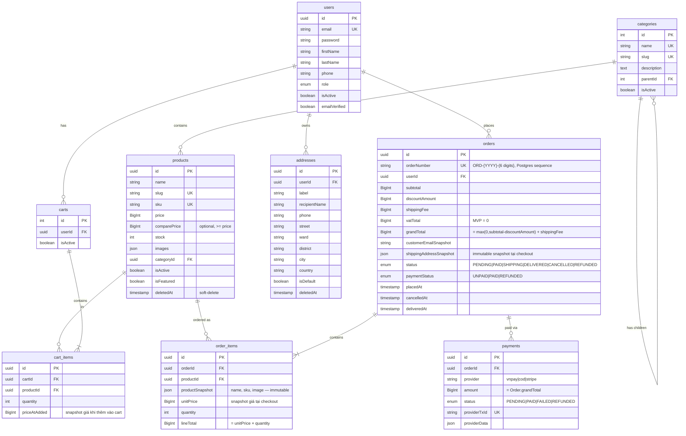

# Database Conceptual Diagram & Projections

> [!NOTE]
> This document visualizes the relational architecture of the E-commerce API database and projects the scaling requirements over a 1-year operational horizon.

---

## Executive Summary

A robust E-commerce platform requires a highly normalized, relational foundation capable of handling complex associations between customers, products, and financial transactions. This architecture is modeled through Prisma schema definitions and PostgreSQL migrations, structured to prioritize ACID compliance during order creation while maintaining high read throughput for the product catalog.

---

## Entity Relationship Diagram

The following Mermaid diagram outlines the foundational relationships, Cardinalities, and Foreign Key (FK) constraints.



    idempotency_keys {
        uuid id PK
        string key UK "UUID do client sinh, header Idempotency-Key"
        string resultId "orderId hoặc paymentId"
        string bodyHash "SHA-256 của request body"
        timestamp expiresAt "createdAt + 24h, cron cleanup"
        timestamp createdAt
    }

---

## Design Decisions

- **Audit & Historical Integrity**: Price points and shipping addresses must never mutate retroactively. `cart_items` and `order_items` capture localized snapshots of the product prices. The `orders` table captures a static `shippingAddressSnapshot` JSON payload at the moment of checkout.
- **Hierarchical Categories**: The `categories` table uses Adjacency List modeling (a `parentId` pointing to itself) to construct infinite-depth category trees (e.g., Electronics > Phones > Smartphones).
- **Money Type = BigInt (đồng VND)**: Mọi field tiền dùng `BigInt` đơn vị đồng VND (không có cent). KHÔNG dùng `Decimal`/`Float`/`number`. Serialization ra JSON → convert BigInt sang `string` qua interceptor hoặc `@Transform`. Client nhận string và tự parse.
- **Order Number = Postgres Sequence**: `order_number_seq` atomic counter, format `ORD-{YYYY}-{6 chữ số}` (vd `ORD-2026-000123`). Không dùng random/UUID cho orderNumber.
- **Order Math Formula**: `grandTotal = max(0, subtotal - discountAmount) + shippingFee`. MVP: `vatTotal = 0`. Discount trừ TRƯỚC khi tính VAT (đúng luật thuế VN).

## Delete Strategy

| Relationship                     | Rule                  | Reason                                                    |
| -------------------------------- | --------------------- | --------------------------------------------------------- |
| `Product` → `OrderItem`          | **RESTRICT**          | Cannot delete a product that exists in a historical order |
| `User` → `RefreshToken`, `Cart`  | **CASCADE**           | Session data is owned by the user — delete together       |
| `Category` → `Product`           | **SET NULL**          | Products become uncategorized, not deleted                |
| `User` → `Address`               | **App-level soft-delete cascade** | Khi User bị soft-delete (`deletedAt` set), app chạy `UPDATE addresses SET deletedAt = NOW() WHERE userId = :id` trong cùng transaction. Address có field `deletedAt` riêng. |
| `User` → `Order`, `Payment`      | **GIỮ NGUYÊN**        | Pháp lý/kiểm toán — không xóa hay soft-delete            |

---

## Capacity Projections (1-Year Horizon)

> [!TIP]
> Storage overhead is calculated assuming an average payload size coupled with B-Tree index bloating.

| Entity        | Growth Velocity | 1-Year Est. Rows | Storage Profile                           |
| ------------- | --------------- | ---------------- | ----------------------------------------- |
| `users`       | Slow            | 10,000           | ~5MB (Includes heavy UUID indexes)        |
| `categories`  | Static          | 200              | < 1MB                                     |
| `products`    | Medium          | 5,000            | ~10MB (Heavy due to JSON payload arrays)  |
| `carts`       | Slow            | 10,000           | ~1MB (1 active cart per user limit)       |
| `cart_items`  | Medium          | 30,000           | ~6MB (High churn/update rate)             |
| `orders`      | Fast            | 50,000           | ~40MB (Contains JSON address snapshots)   |
| `order_items` | Very Fast       | 150,000          | ~45MB (~3 items per order avg.)           |
| `payments`    | Fast            | 50,000           | ~30MB (Records remote PSP JSON responses) |

**Total Estimated Database Size (Data):** ~250 MB  
**Total Estimated Database Size (Including Indices & WAL):** ~1.0 GB

---

## Security & Performance Notes

### High-Value Indices

PostgreSQL automatically creates indices on Primary Keys and Unique Constraints. To guarantee read performance, specific composite indices must be manually defined.

> [!WARNING]
> Do not over-index the `cart_items` table, as it experiences exceptionally high write/update churn. Only index foreign keys.

```sql
-- Catalog Search Acceleration
CREATE INDEX idx_products_category_active ON products(categoryId, isActive);
CREATE INDEX idx_products_featured_active ON products(isFeatured, isActive);

-- User Retrieval
CREATE INDEX idx_users_email_active ON users(email, isActive);

-- Active Cart Resolution
CREATE UNIQUE INDEX idx_carts_userId_active ON carts(userId, isActive);

-- Default Address: chỉ 1 default per user (partial unique index — không hỗ trợ trực tiếp trong Prisma schema, phải thêm vào migration SQL)
CREATE UNIQUE INDEX addresses_one_default_per_user
ON addresses (userId) WHERE isDefault = true AND deletedAt IS NULL;
```

### Query Optimization Strategies

1. **Deny over-fetching**: Always restrict payloads. Use Prisma `select` clauses such as `{ id: true, name: true, price: true }`. Pulling massive JSON columns (`images`) during list queries will cripple RAM.
2. **Eager vs. Lazy Loading**: Never eager load `orderItems` on the root `Product` entity. Always paginate historical relationship queries defensively.
3. **Pagination Engine**: Utilize Keyset Pagination (Cursor-based) over traditional `LIMIT/OFFSET` for the `orders` list, as high offsets require the database engine to perform expensive table scans.
