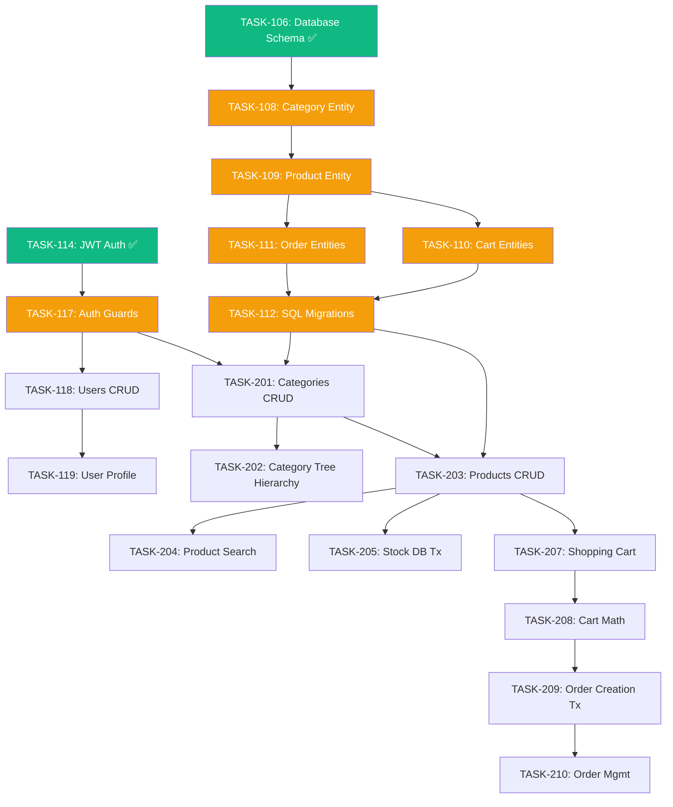

# Project Status & Roadmap

## Code Implementation Status

> [!TIP]
> This represents the actual codebase completion, not the documentation completion.

```text
Phase 1: Foundation (TASK-101 → TASK-125) [░░░░░░░░░░░░░░░░░░░░]   0%  (0/25)
Phase 2: Revenue   (TASK-201 → TASK-226)  [░░░░░░░░░░░░░░░░░░░░]   0%  (0/26)
Phase 3: Scale     (TASK-301 → TASK-329)  [░░░░░░░░░░░░░░░░░░░░]   0%  (0/29)
─────────────────────────────────────────────────────────────────────────────
TOTAL COMPLETION:                          [░░░░░░░░░░░░░░░░░░░░]   0%  (0/80)
```

### Phase 1 — Chưa bắt đầu ⏳

25 foundation tasks — chưa implement:

- Project scaffolding, environment config, Docker/PostgreSQL setup
- Full Prisma schema (User, Category, Product, Cart, CartItem, Order, OrderItem, Payment, Address, tokens)
- JWT authentication, Guards, Decorators, Role-based access
- Users CRUD, profile, change-password
- Refresh tokens, email verification, password recovery
- Seed data

### Phase 2 — Chưa bắt đầu ⏳

| Task ID  | Component         | Status         |
| -------- | ----------------- | -------------- |
| TASK-201 | Categories CRUD   | ⏳ Not started |
| TASK-202 | Category Tree     | ⏳ Not started |
| TASK-203 | Products CRUD     | ⏳ Not started |
| TASK-204 | Product Filtering | ⏳ Not started |
| TASK-207 | Shopping Cart     | ⏳ Not started |
| TASK-208 | Cart Calculations | ⏳ Not started |
| TASK-209 | Order Creation    | ⏳ Not started |
| TASK-210 | Order Management  | ⏳ Not started |

---

## Immediate Priorities (Next 4 Tasks)

| Task ID  | Component         | Priority    | Est. Time | Status      |
| -------- | ----------------- | ----------- | --------- | ----------- |
| TASK-207 | Shopping Cart     | 🔴 Critical | 5h        | Not started |
| TASK-208 | Cart Calculations | 🔴 Critical | 3h        | Not started |
| TASK-209 | Order Creation    | 🔴 Critical | 5h        | Not started |
| TASK-210 | Order Management  | 🟡 High     | 4h        | Not started |

**Total Estimated Effort:** ~17 hours (2–3 engineering days)

---

## Week-by-Week Roadmap

- **Week 1:** Shopping Cart — add/update/remove items, cart calculations (TASK-207, TASK-208)
- **Week 2:** Order Creation + Order Management — placement flow, status updates, cancellation (TASK-209, TASK-210)
- **Week 3:** Payment Integration — VNPay webhook, PaymentStatus sync (TASK-221)
- **Week 4:** Product enhancements — stock management, file upload, filtering (TASK-205, TASK-206, TASK-204)
- **Week 5:** Infrastructure — global error handling, logging, Swagger docs (TASK-212, TASK-213, TASK-215)
- **Week 6:** Testing + bug squashing → **MVP READY** 🚀

> [!IMPORTANT]
> Use the phased task files directly as the implementation source of truth. Start from the relevant `TASK-xxx` document, then verify against the current codebase before making changes.

---

## Dependency Graph



---

## Development Constraints

> [!WARNING]
> Deviating from these practices will introduce technical debt.

### Prisma Migration Strategy

- **Immutability**: NEVER edit a migration file that has already been executed (`migration:run`). If a mistake was made, run `migration:revert` or generate a new migration.
- **Data vs. Schema**: Do not mix structural `ALTER TABLE` operations with complex `INSERT`/`UPDATE` data migrations in the same file.

### Test-Driven Development (TDD)

- Write unit tests alongside the service implementation — not after.
- Every critical financial calculation (Cart Math, Order Totals) demands 100% branch test coverage.

### Work Session Routine

1. Pull the latest code.
2. Spin up Docker: `docker-compose up -d`.
3. Review this file and the relevant phased task file.
4. Select the next unblocked task from the Dependency Graph above.
