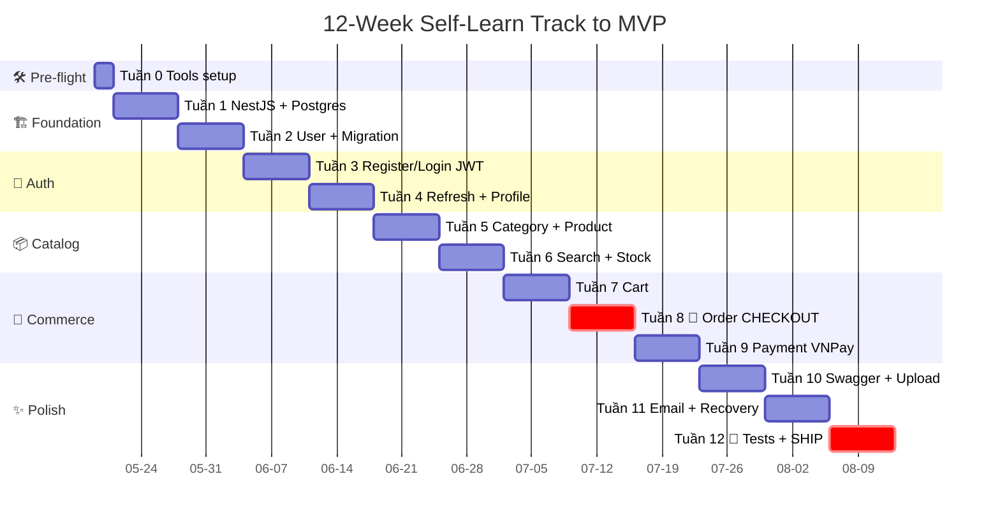
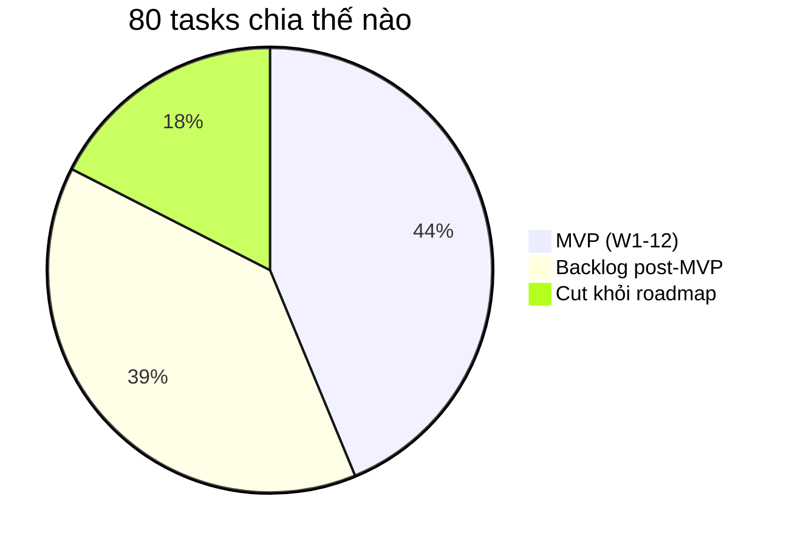

# 🎓 Roadmap Self-Learn — BE NestJS E-commerce

> **Mục đích**: Refactor 80 task của `planning/` thành lộ trình **tự cài đặt, tự code tay** theo **đường cong học BE**.
> **Nguyên tắc**: mỗi bước nhỏ, chạy được, hiểu khái niệm trước khi gõ phím. Khi xong 1 milestone thì commit.

---

## 🗺️ Roadmap Visual

### 1. Dependency graph — 12 tuần

```mermaid
graph TD
    W0([🛠️ Tuần 0<br/>Setup Tools<br/>Node + Docker + IDE]):::pre
    W1[Tuần 1<br/>Hello NestJS + Postgres<br/>health check]:::found
    W2[Tuần 2<br/>User Entity + Migration<br/>base classes]:::found
    W3[Tuần 3<br/>Auth: Register / Login<br/>JWT + Guards]:::auth
    W4[Tuần 4<br/>Refresh Token + Profile<br/>Change Password]:::auth
    W5[Tuần 5<br/>Category + Product CRUD<br/>BigInt money + role guard]:::catalog
    W6[Tuần 6<br/>Filter + Search FTS + Stock<br/>row-level lock]:::catalog
    W7[Tuần 7<br/>Shopping Cart<br/>Guest cookie + snapshot]:::commerce
    W8[🎯 Tuần 8<br/>Order CHECKOUT<br/>Eager stock + Idempotency<br/>State machine<br/>MVP DEMO-READY]:::mvp
    W9[Tuần 9<br/>Payment VNPay<br/>HMAC webhook]:::commerce
    W10[Tuần 10<br/>Errors + Swagger<br/>File upload + Logging]:::polish
    W11[Tuần 11<br/>Email Verify + Reset<br/>Mailtrap → Resend]:::polish
    W12[🚀 Tuần 12<br/>Unit + E2E Tests<br/>SHIP]:::ship

    W0 --> W1 --> W2 --> W3 --> W4 --> W5 --> W6 --> W7 --> W8 --> W9 --> W10 --> W11 --> W12

    classDef pre fill:#94a3b8,color:#fff,stroke:#475569,stroke-width:2px
    classDef found fill:#3b82f6,color:#fff,stroke:#1e40af,stroke-width:2px
    classDef auth fill:#8b5cf6,color:#fff,stroke:#6d28d9,stroke-width:2px
    classDef catalog fill:#06b6d4,color:#fff,stroke:#0e7490,stroke-width:2px
    classDef commerce fill:#f97316,color:#fff,stroke:#c2410c,stroke-width:2px
    classDef mvp fill:#f59e0b,color:#fff,stroke:#b45309,stroke-width:4px
    classDef polish fill:#ec4899,color:#fff,stroke:#be185d,stroke-width:2px
    classDef ship fill:#10b981,color:#fff,stroke:#047857,stroke-width:4px
```



### 2. Gantt — timeline 12 tuần



### 3. Concept learning curve

Mỗi tuần học 1 group concept cốt lõi. Concept khó (đắt) dồn về cuối phase:

```mermaid
graph LR
    subgraph "🏗 Foundation (W1-2)"
        C1[Module/DI<br/>Controller→Service]
        C2[Prisma + Migration<br/>UUID/Soft-delete]
    end
    subgraph "🔐 Auth (W3-4)"
        C3[JWT + bcrypt<br/>Guards + Decorators]
        C4[Refresh rotation<br/>Token family<br/>5s tolerance]
    end
    subgraph "📦 Catalog (W5-6)"
        C5[Repository pattern<br/>Pagination DTO<br/>BigInt money]
        C6[Postgres FTS<br/>Row-level lock<br/>Transaction]
    end
    subgraph "🛒 Commerce (W7-9)"
        C7[Cart Guest+User<br/>Snapshot pattern]
        C8[Atomic checkout<br/>Idempotency-Key<br/>State machine]
        C9[Webhook HMAC<br/>Provider idempotent]
    end
    subgraph "✨ Polish (W10-12)"
        C10[Filter+Interceptor<br/>Swagger+Upload]
        C11[Email service<br/>Token one-time]
        C12[Unit+E2E tests<br/>SHIP 🚀]
    end

    C1 --> C2 --> C3 --> C4 --> C5 --> C6 --> C7 --> C8 --> C9 --> C10 --> C11 --> C12
```



### 4. MVP scope vs Backlog



### 5. ASCII timeline (offline view)

```text
              ┌─ MVP demo-able ─┐    ┌─ SHIP ─┐
              ▼                 ▼    ▼        ▼
W0 ─── W1 ─── W2 ─── W3 ─── W4 ─── W5 ─── W6 ─── W7 ─── W8 ─── W9 ─── W10 ─── W11 ─── W12
 │      │      │      │      │      │      │      │      │      │       │       │       │
 │      │      │      │      │      │      │      │      │      │       │       │       │
Tool  Hello   User   Auth   Refresh Cat+   Search Cart  Order  Pay     Polish  Email   Test
       Nest   Entity Login         Prod   Stock        🎯CORE  VNPay           Verify  SHIP🚀
       +DB

Color: ⚪Pre  🔵Foundation  🟣Auth  🟦Catalog  🟧Commerce  🟡MVP  🌸Polish  🟢Ship
```

> 🎯 **Tuần 8** = MVP có thể demo (register → browse → cart → checkout có thanh toán mock).
> 🚀 **Tuần 12** = ship-ready (có test, không bug critical).

---

## 1. Vấn đề của planning hiện tại (Problem Statement)

Đứng từ góc nhìn của một dev tự học BE, tài liệu hiện tại có 3 trở ngại:

1. **Quá tải (80 task)** — không biết bắt đầu từ đâu, dễ bỏ cuộc. Phase 1 nhồi 25 task setup+entity+auth lẫn lộn.
2. **Sắp xếp theo "business value", không phải "learning curve"** — ví dụ TASK-122 (Base Classes) bị đẩy vào engineering trong khi người mới chưa cần abstraction; TASK-117 (Guards) đặt trước khi học khái niệm Provider/DI.
3. **Phase 3 lẫn must-have vs nice-to-have** — Unit Test (301) đứng cạnh Microservices (323), Kubernetes (321), GraphQL (322). Người tự học không phân biệt được cái nào skip được.

Kết quả: đọc xong tài liệu không biết viết file `.ts` đầu tiên là file nào.

---

## 2. Giải pháp (Solution)

Refactor thành **roadmap 12 tuần** theo learning curve, mỗi tuần một **chủ đề BE** rõ ràng. Giữ nguyên 80 task gốc làm "spec chi tiết" — chỉ thêm 1 lớp index mới sắp xếp lại thứ tự + cắt scope MVP.

**Triết lý**:

- **Build → Break → Fix → Understand**: code chạy được trước, refactor sau.
- **Học khái niệm trước khi gõ**: mỗi tuần có 1 mục "What you learn" liệt kê concept NestJS/DB.
- **MVP đầu tiên ở tuần 8**: đăng ký → xem sản phẩm → bỏ giỏ → đặt hàng → thanh toán (mock VNPay).
- **Phase 3 cắt 80% → backlog**: chỉ giữ Unit Test, Caching, Rate Limit, RBAC. Bỏ Microservices/K8s/GraphQL/ML khỏi roadmap chính.

---

## 3. Cấu trúc roadmap mới

```
planning/
├── README.md           ← entry root
├── docs/               ← spec, glossary, meta (file này nằm đây)
│   ├── README.md
│   ├── CONTEXT.md      ← glossary + design decisions
│   ├── REQUIREMENTS.md ← BRD
│   ├── ROADMAP.md      ← FILE NÀY
│   ├── STATUS.md
│   └── TASK_INDEX.md
├── setup/              ← hạ tầng, convention, tooling (HOW)
└── business/           ← domain, feature (WHAT)
```

Roadmap **chỉ là 1 layer dẫn đường** trỏ vào TASK file có sẵn ở `setup/` và `business/`.

---

## 4. 🗺️ Lộ trình 12 tuần

> Mỗi tuần ước 8–12h code (2h/ngày × 5 ngày). Chậm hơn cũng OK — quan trọng là **hiểu**.

### TUẦN 0 — Pre-flight (1–2 ngày, trước khi code)

**What you learn**: cài Node.js, pnpm/npm, Docker, VSCode, Git. Biết PostgreSQL là gì.

**Làm**:

1. Cài Node 20 LTS, pnpm, Docker Desktop, DBeaver/TablePlus, Postman/Insomnia.
2. Đọc lướt (KHÔNG code): `setup/CONVENTIONS.md` §1–3 + `CONTEXT.md` (glossary).
3. Tạo file `.env.example` rỗng, init `git init`, commit "chore: bootstrap".

**Skip**: TASK-121 (README chi tiết) — viết README sau khi có code.

---

### TUẦN 1 — Hello NestJS + PostgreSQL

**What you learn**: NestJS module/controller/service, DI cơ bản, Prisma, kết nối DB.

**Task gốc**: TASK-101, 102, 103, 104

**📐 ĐỌC TRƯỚC**: [`../setup/PROJECT_STRUCTURE.md`](../setup/PROJECT_STRUCTURE.md) — tạo đúng layout `src/{common, config, shared, modules, infrastructure, jobs}/` từ đầu, không refactor sau.

**Mục tiêu**: `GET /health/live` + `GET /health/ready` (terminus) trả 200 với DB connected. App ở `/api/v1/*`, healthcheck ở root.

**Step-by-step**:

1. `nest new ecom-api --strict` → chạy `npm run start:dev` → mở `localhost:3000`.
2. Tạo cấu trúc folder theo `PROJECT_STRUCTURE.md`: `src/{common, config, shared, modules, infrastructure, jobs}/`.
3. Setup path alias `@common/*`, `@modules/*`, ... trong `tsconfig.json` + `nest-cli.json`.
4. Cài `@nestjs/config class-validator class-transformer`, tạo `.env`, làm 1 `ConfigModule` validate qua class-validator `EnvSchema` (biến: `DATABASE_URL`, `PORT`, `NODE_ENV`, `CORS_ORIGINS`, `LOG_FORMAT`).
5. `main.ts`: `app.setGlobalPrefix('api/v1', { exclude: ['health', 'metrics'] })`, enable CORS env-based whitelist (xem CONVENTIONS §12), setup Helmet.
6. Docker compose PostgreSQL 16 local (1 file `docker-compose.yml`, 15 dòng).
7. Cài Prisma, `prisma init`, viết model placeholder, `prisma migrate dev --name init`.
8. Setup `PrismaService` ở `src/common/prisma/` (global module, `OnModuleInit/Destroy` connect/disconnect).
9. Cài `@nestjs/terminus`, tạo `HealthModule` ở `src/modules/health/`. Endpoint `/health/live` (chỉ check Nest respond), `/health/ready` (check DB qua Prisma indicator).

**Commit kết thúc**: `feat: health check connects to postgres + terminus`.

**Skip tuần này**: TASK-105 (global validation) — chưa có DTO thì chưa cần.

---

### TUẦN 2 — User entity + Migration discipline

**What you learn**: Prisma schema, migration đúng cách, UUID, soft-delete, base entity.

**Task gốc**: TASK-106 (schema strategy), TASK-107 (User entity), TASK-112 (run migration), TASK-113 (best practice), TASK-122 (base entity fields).

**Mục tiêu**: bảng `users` trong DB có đủ field `id/email/password/role/createdAt/updatedAt/deletedAt`.

**Step-by-step**:

1. Đọc `setup/DATABASE_SCHEMA.md` phần User.
2. Viết model `User` trong `schema.prisma`, dùng `@id @default(uuid())`.
3. `prisma migrate dev --name add_users` → mở DBeaver verify bảng.
4. Tự thử: tạo migration sai → revert → tạo lại. **Học cảm giác migration là 1-chiều**.
5. Seed 1 user qua `prisma db seed` (TASK-125 phần đơn giản nhất).

**Commit**: `feat(users): add user model with soft-delete`.

---

### TUẦN 3 — Auth: Register + Login (JWT)

**What you learn**: bcrypt, JWT, DTO + class-validator, AuthGuard, passport-jwt.

**Task gốc**: TASK-114, 115, 116, 105 (global validation), 117 (guards).

**Mục tiêu**: `POST /auth/register` + `POST /auth/login` → trả `accessToken`. `GET /me` cần Bearer token.

**Step-by-step**:

1. Cài `@nestjs/jwt`, `passport`, `passport-jwt`, `bcrypt`, `class-validator`.
2. Bật `ValidationPipe` global trong `main.ts` (`whitelist`, `forbidNonWhitelisted`).
3. DTO `RegisterDto` (email, password ≥ 8). Endpoint `POST /auth/register` → hash bcrypt → save.
4. Endpoint `POST /auth/login` → compare bcrypt → sign JWT 15 phút.
5. `JwtAuthGuard` (đăng ký global `APP_GUARD`) + `@Public()` decorator. `@CurrentUser()` để inject user.
6. `GET /me` → trả user từ token. Test bằng Postman: không token → 401, sai token → 401.

**Commit**: `feat(auth): register login with jwt`.

**Skip**: refresh token, email verify — tuần sau.

---

### TUẦN 4 — Refresh Token + Profile + Change Password

**What you learn**: Token rotation, session family, password change flow.

**Task gốc**: TASK-118, 119, 120, 123.

**Mục tiêu**: long-lived refresh token, đổi password thì revoke session.

**Step-by-step**:

1. Bảng `refresh_tokens` (id, userId, tokenHash, familyId, revokedAt, expiresAt).
2. `POST /auth/refresh` → check hash → rotate (cấp cặp mới, revoke cũ).
3. `PATCH /users/me` (profile), `POST /users/me/change-password` (cần currentPassword).
4. Đổi password → revoke toàn bộ `familyId` của user.

**Commit**: `feat(auth): refresh token rotation and change password`.

**Checkpoint**: cuối tuần này bạn đã có **bounded context Identity** xong. Đây là milestone đầu tiên đáng tự thưởng.

**Skip tuần này**: TASK-124 (email verify + password reset) — cần email service, để sau tuần 11.

---

### TUẦN 5 — Catalog: Category + Product CRUD

**What you learn**: One-to-many relation, slug, pagination, repository pattern (optional).

**Task gốc**: TASK-108, 109, 111 (entity), TASK-201, 203.

**Mục tiêu**: admin tạo category + product, anyone có thể `GET /products?page=1`.

**Step-by-step**:

1. Model `Category` (id, name, slug, parentId?), `Product` (id, sku, slug, name, price BigInt (đồng VND), stock, categoryId, deletedAt).
2. Migration, seed 5 category + 20 product.
3. `RolesGuard` + `@Roles(Role.ADMIN)` cho endpoint POST/PATCH/DELETE.
4. `GET /products` với pagination cursor hoặc offset (chọn 1, đừng cố làm cả hai).
5. Util `slugify()` trong `src/shared/utils/` (TASK-122).

**Commit**: `feat(catalog): category and product crud`.

**Skip**: variants (TASK-218), reviews (TASK-219), wishlist (TASK-220) — nice-to-have.

---

### TUẦN 6 — Product Filter + Search + Stock

**What you learn**: query builder, full-text search Postgres cơ bản, Prisma transaction.

**Task gốc**: TASK-204, 205, 202.

**Mục tiêu**: `GET /products?category=dien-thoai&minPrice=1000000&q=iphone` chạy đúng. Stock update có transaction.

**Step-by-step**:

1. Filter chain trong service (where dynamic).
2. Search dùng **Postgres FTS** (`tsvector` + GIN + `unaccent`) — diacritic-insensitive cho user VN. 1 migration tạo generated column + GIN index, query qua `plainto_tsquery`. Elasticsearch hoãn (chỉ cần khi >1M document).
3. Category tree query: dùng recursive CTE hoặc materialized path. Chọn cách đơn giản: query parent + 1 cấp con.
4. Endpoint admin `PATCH /products/:id/stock` dùng `prisma.$transaction` (read stock → update). **Học race condition**.

**Commit**: `feat(catalog): product filtering and stock tx`.

**Skip**: file upload ảnh (TASK-206, 223) — tuần 10.

---

### TUẦN 7 — Shopping Cart

**What you learn**: 1-to-1 active resource, idempotent endpoints, snapshot pattern (`priceAtAdded`).

**Task gốc**: TASK-110 (entity), TASK-207, 208.

**Mục tiêu**: user thêm/sửa/xóa item, cart tự tính total.

**Step-by-step**:

1. Model `Cart` (1 active/user) + `CartItem` (cartId, productId, quantity, priceAtAdded).
2. `POST /cart/items` (idempotent theo productId — nếu đã có thì cộng quantity).
3. `PATCH /cart/items/:id`, `DELETE /cart/items/:id`.
4. `GET /cart` trả `items[]` + `subtotal` + cờ `priceChanged` nếu `product.price != priceAtAdded`.
5. **Test thủ công kỹ**: 2 user khác nhau, 2 cart độc lập, không leak.

**Commit**: `feat(cart): add update remove items with price snapshot`.

---

### TUẦN 8 — Order Creation 🚀 **MVP MILESTONE**

**What you learn**: transaction lớn, immutability, snapshot pattern, state machine.

**Task gốc**: TASK-111 (entity), TASK-209, 210.

**Mục tiêu**: `POST /orders` từ cart → tạo order PENDING + trừ stock + xóa cart, **tất cả atomic**.

**Step-by-step**:

1. Model `Order` (id, orderNumber, userId, status enum, total, shippingAddress JSONB, customerEmailSnapshot) + `OrderItem` (productSnapshot JSONB).
2. `POST /orders` wrap `$transaction`:
   - Đọc cart, validate stock đủ.
   - Trừ stock từng product.
   - Tạo Order + OrderItem (snapshot product info).
   - Xóa cart items.
3. `GET /orders/me`, `GET /orders/:id` (chỉ owner).
4. Admin `PATCH /orders/:id/status` — chỉ allow transition theo state machine (`PENDING → PAID → SHIPPING → DELIVERED`, hoặc → `CANCELLED`).

**Commit**: `feat(orders): checkout with transaction and immutable snapshot`.

**🎉 Đây là MVP demo-được**. Từ register → login → browse → cart → order. Tự thưởng.

---

### TUẦN 9 — Payment (mock VNPay)

**What you learn**: webhook, signature verify, idempotency key.

**Task gốc**: TASK-221.

**Mục tiêu**: VNPay sandbox (hoặc mock fake) → callback → Order `PENDING → PAID`.

**Step-by-step**:

1. Endpoint `POST /payments/vnpay/checkout/:orderId` trả URL redirect (mock cũng OK).
2. Endpoint `POST /payments/vnpay/webhook` nhận callback, verify HMAC, update Order.
3. Idempotent: cùng `transactionId` gọi 2 lần không trừ stock 2 lần.
4. Test scenarios: success, fail, replay attack.

**Commit**: `feat(payment): vnpay webhook with idempotency`.

**Skip**: discount/coupon (TASK-224), multiple shipping (TASK-225) — backlog.

---

### TUẦN 10 — Polish API: Error handling + Swagger + File upload

**What you learn**: Exception filter, request logging, interceptor, multipart upload, Swagger.

**Task gốc**: TASK-212, 213, 214, 215, 206, 223.

**Mục tiêu**: response chuẩn `{ statusCode, code, message, errors[], requestId }`. Swagger UI ở `/api`. Upload ảnh product.

**Step-by-step**:

1. `GlobalExceptionFilter` format theo schema trong `setup/CONVENTIONS.md` §14.
2. `LoggingInterceptor` log `[method] path - status - duration` + correlation ID.
3. `ResponseTransformInterceptor` bọc data `{ data, meta }`.
4. Swagger: `@ApiTags`, `@ApiOperation`, `@ApiProperty` cho mọi DTO.
5. File upload local disk trước (storage adapter pattern). S3 sau.

**Commit**: `feat(infra): global filters interceptors swagger upload`.

---

### TUẦN 11 — Email + Account Verification + Password Reset

**What you learn**: queue đơn giản (BullMQ optional), template email, token một lần.

**Task gốc**: TASK-124.

**Mục tiêu**: register → email xác thực → click link → `emailVerified = true`. Forgot password → email link → reset.

**Step-by-step**:

1. Cài Mailtrap (dev) hoặc `nodemailer` + ethereal email.
2. Bảng `verification_tokens` (userId, token, type enum, expiresAt, usedAt).
3. Endpoint `POST /auth/forgot`, `POST /auth/reset`, `GET /auth/verify-email`.
4. Token dùng 1 lần, expiry 1h.

**Commit**: `feat(auth): email verification and password reset`.

---

### TUẦN 12 — Testing + Cleanup → SHIP 🚢

**What you learn**: Jest, supertest, test pyramid, AAA pattern.

**Task gốc**: TASK-301 (unit test), TASK-302 (e2e).

**Mục tiêu**: ≥ 60% coverage cho service layer. E2E test luồng checkout đầu-cuối.

**Step-by-step**:

1. Unit test `CartService.calculate()`, `OrderService.checkout()` (mock prisma bằng `@golevelup/ts-jest`).
2. E2E test `POST /auth/register → /auth/login → /products → /cart/items → /orders` (1 file).
3. Viết `README.md` cho repo (giờ mới viết — TASK-121).
4. Fix linting cuối cùng, `npm run build` pass.

**Commit**: `test: unit and e2e coverage + readme`.

---

## 5. Backlog (sau khi xong tuần 12)

Khi đã có MVP chạy, mỗi cuối tuần học **1 chủ đề nâng cao** từ backlog dưới. Không cần theo thứ tự — chọn cái bạn tò mò nhất.

| Topic              | Task ID                | Lý do hoãn                                        |
| :----------------- | :--------------------- | :------------------------------------------------ |
| Rate limiting      | TASK-313               | Học khi gặp abuse thực tế.                        |
| RBAC nâng cao      | TASK-320               | Hiện đã có Roles enum, đủ MVP.                    |
| Caching Redis      | TASK-306, 311          | Đo trước rồi mới cache. Premature optimization.   |
| Logging/Tracing    | TASK-312               | Khi deploy production mới đáng.                   |
| API versioning     | TASK-314               | Khi có v2 mới cần.                                |
| Reviews/Ratings    | TASK-219               | Feature, không phải kỹ năng BE cốt lõi.           |
| Wishlist           | TASK-220               | Tương tự.                                         |
| Discount/Coupon    | TASK-224               | Business rule phức tạp — học sau khi quen domain. |
| 2FA                | TASK-319               | Khi cần security cao.                             |
| OAuth Social Login | TASK-327               | Khi muốn frontend ngon.                           |
| CI/CD              | TASK-308               | Khi push lên cloud lần đầu.                       |
| Docker production  | TASK-321 (phần Docker) | Khi deploy thật.                                  |

## 6. Cắt hẳn khỏi roadmap (nên bỏ luôn cho project học)

Những task này thuộc về **systems engineering** quy mô lớn, không phù hợp self-learn từ 0:

- TASK-305, 328 (AI Recommendation / ML) — không phải BE.
- TASK-316 (Elasticsearch) — Postgres FTS đủ dùng cho MVP.
- TASK-322 (GraphQL) — chọn REST hoặc GraphQL, đừng làm cả hai khi mới học.
- TASK-323, 324 (Microservices, Kafka) — premature.
- TASK-321 phần Kubernetes — sau khi đi làm thực tế.
- TASK-329 (Analytics dashboard) — frontend job.
- TASK-325, 326 (i18n, multi-currency) — business decision, không phải learning.
- TASK-217 (Q&A System), TASK-218 (Variants), TASK-226 (Inventory Alerts) — feature phụ.

Không xóa file — chỉ dán nhãn "Out of scope for self-learn track" trong task gốc.

---

## 7. Decision Document

### Cấu trúc tài liệu

- **Giữ nguyên nội dung** mọi file `TASK-xxx.md` + `CHARTER.md` + `CONTEXT.md` + `CONVENTIONS.md` + `DATABASE_SCHEMA.md`. Refactor chỉ **sắp xếp lại vị trí** (setup/ vs business/), không sửa nội dung spec.
- **Thêm file mới**: `ROADMAP.md` (file này) — entry point cho người tự học.
- **Cập nhật**: `README.md` thêm 1 dòng "Tự học BE? → đọc `ROADMAP.md`".

### Học liệu mapping

Mỗi tuần trong roadmap đã gắn:

- **What you learn**: 3–5 khái niệm BE.
- **Task ID gốc**: liên kết spec chi tiết.
- **Mục tiêu kiểm chứng**: cách verify đã làm xong (curl/Postman/SQL query).
- **Commit message gợi ý**: theo Conventional Commits.

### Quyết định scope

| Quyết định                       | Lý do                                                                                                    |
| :------------------------------- | :------------------------------------------------------------------------------------------------------- |
| MVP = tuần 8 (cart + order)      | Đủ demo, đủ học transaction + snapshot — 2 concept đắt giá nhất.                                         |
| Cắt Phase 3 từ 29 → 4 task chính | Phần còn lại là systems eng quy mô lớn, không phù hợp self-learn.                                        |
| Email verify đẩy xuống tuần 11   | Cần external service (mail provider) → tăng friction cho người mới.                                      |
| Test viết ở tuần 12 (cuối)       | TDD strict không phù hợp người chưa quen — học test khi đã có code chạy. Sau đó luyện TDD ở project sau. |
| Giữ Prisma làm ORM               | TypeORM/MikroORM phức tạp hơn. Prisma docs tốt, migration tự sinh.                                       |
| Bỏ TDD strict ở giai đoạn 1–8    | Convention nói TDD, nhưng self-learner cần "see it work" trước.                                          |

### State machine + Snapshot pattern

Hai concept quan trọng nhất của project — phải hiểu thấu khi làm tuần 7–8:

- **Snapshot (`priceAtAdded`, `productSnapshot` JSONB)**: Order là tài liệu pháp lý, không được thay đổi khi product gốc bị edit/xóa.
- **State machine Order**: chỉ cho phép transition hợp lệ. Service phải có method `assertCanTransition(from, to)`.

Xem `CONTEXT.md` đoạn "Order State Machine".

---

## 8. Testing Decisions

### Test gì, không test gì

**Test (external behavior)**:

- `AuthService.register()`: email trùng → throw `ConflictException`.
- `CartService.addItem()`: thêm product hết stock → throw `BadRequestException`.
- `OrderService.checkout()`: stock không đủ → rollback toàn bộ transaction, cart giữ nguyên.
- E2E: full flow register → login → order.

**KHÔNG test (implementation detail)**:

- Không test bcrypt sinh hash gì (đó là lib).
- Không test Prisma trả kết quả gì (đó là ORM).
- Không test guard nội tại (test ở level controller integration là đủ).

### Prior art

Convention `setup/CONVENTIONS.md` §9 đã định nghĩa AAA pattern + `@golevelup/ts-jest`. Self-learn track dùng đúng — chỉ giảm bớt strictness ở giai đoạn đầu.

### Coverage target self-learn

- Tuần 1–8: 0% test (focus build).
- Tuần 12: ≥ 60% service layer + 1 e2e happy path.
- Sau MVP: refactor TDD-style cho feature mới.

---

## 9. Out of Scope (refactor này KHÔNG làm)

- **Không sửa nội dung file TASK-xxx**. Spec gốc giữ nguyên.
- **Không đổi cấu trúc thư mục** `planning/`. Chỉ thêm file mới.
- **Không quyết định stack thay thế** (vẫn NestJS + Prisma + Postgres).
- **Không setup CI/CD, Docker production, K8s** — backlog.
- **Không viết code mẫu** trong file roadmap — chỉ chỉ dẫn step.
- **Không tạo GitHub issue** (repo chưa init git remote).

---

## 10. Bước tiếp theo

1. Đọc roadmap này một lượt (15 phút).
2. Bắt đầu **Tuần 0** ngay hôm nay (cài tools).
3. Tuần 1 vào ngày mai, code line đầu tiên.
4. Mỗi cuối tuần: cập nhật progress vào `STATUS.md` (chỉ tick task tương ứng).
5. Khi vướng concept nào — tra `CONTEXT.md` (glossary) hoặc `setup/CONVENTIONS.md` (rule).

**Triết lý cuối**: học BE không phải đọc 80 task. Là gõ phím, gặp lỗi, fix, hiểu. File này chỉ là bản đồ. Đi mới là điều quan trọng.
