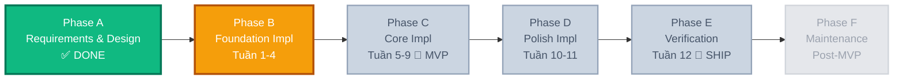
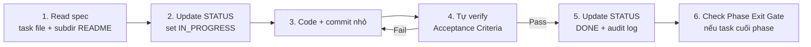

# 📊 STATUS — Waterfall Tracking Dashboard

> **Vai trò**: file live duy nhất theo dõi tiến độ dự án theo mô hình **Waterfall**. Cập nhật sau mỗi task hoàn thành. Không xóa entry cũ — chỉ append.

📍 Hôm nay: `2026-05-19` · Phase hiện tại: **Phase A — Requirements & Design** ✅ (đã đóng) · Sắp vào: **Phase B — Foundation Implementation** ⏳

---

## 🌊 Waterfall Phases

Dự án chia **6 phase tuần tự**. Phase trước phải đạt **Exit Gate** (toàn bộ ✅) mới được mở Phase sau. KHÔNG quay ngược trừ khi exit gate fail.



---

## 📈 Tổng quan tiến độ

```text
Phase A — Requirements & Design        [████████████████████] 100%  ✅ Đóng
Phase B — Foundation Impl  (W1-4)      [░░░░░░░░░░░░░░░░░░░░]   0%  ⏳ Sắp mở
Phase C — Core Impl       (W5-9)      [░░░░░░░░░░░░░░░░░░░░]   0%  ⏸ Khóa (chờ B)
Phase D — Polish Impl     (W10-11)    [░░░░░░░░░░░░░░░░░░░░]   0%  ⏸ Khóa
Phase E — Verification    (W12)       [░░░░░░░░░░░░░░░░░░░░]   0%  ⏸ Khóa
Phase F — Maintenance     (post-MVP)  [░░░░░░░░░░░░░░░░░░░░]   0%  ⏸ Backlog
─────────────────────────────────────────────────────────────────────────
TỔNG (Phase B-E, MVP)                  [░░░░░░░░░░░░░░░░░░░░]   0%  (0/35 task)
```

---

## ✅ Phase A — Requirements & Design (ĐÓNG)

**Mục tiêu**: chốt yêu cầu nghiệp vụ + thiết kế kiến trúc TRƯỚC khi gõ code.

### Exit Gate ✅

- [x] BRD viết xong → [`REQUIREMENTS.md`](./REQUIREMENTS.md)
- [x] Glossary domain đầy đủ → [`CONTEXT.md`](./CONTEXT.md)
- [x] 28 design decisions critical đã lock → CONTEXT.md
- [x] Convention code đầy đủ §1–§15 → [`../setup/CONVENTIONS.md`](../setup/CONVENTIONS.md)
- [x] Database schema thiết kế xong → [`../setup/DATABASE_SCHEMA.md`](../setup/DATABASE_SCHEMA.md)
- [x] API contracts outline cho mỗi bounded context → `business/<context>/README.md`
- [x] Roadmap 12 tuần → [`ROADMAP.md`](./ROADMAP.md)
- [x] Per-subdir README có invariants + DoD

### Deliverables

| Artifact | File | Status |
|----------|------|--------|
| BRD | `docs/REQUIREMENTS.md` | ✅ |
| Glossary + Decisions | `docs/CONTEXT.md` | ✅ |
| Code Convention | `setup/CONVENTIONS.md` | ✅ |
| DB Schema | `setup/DATABASE_SCHEMA.md` | ✅ |
| Roadmap | `docs/ROADMAP.md` | ✅ |
| Task Specs | 79 task files | ✅ |
| Charters | 1 (Identity) + 1 (Revenue) | ✅ |

**Đóng phase A**: 2026-05-19 — duyệt bởi: cá nhân (self-learn).

---

## ⏳ Phase B — Foundation Implementation (HIỆN TẠI)

**Mục tiêu**: build nền tảng kỹ thuật (NestJS + DB + Auth). Hết Phase B → có thể đăng ký + đăng nhập user.

**Phạm vi**: Tuần 1–4 (ROADMAP). ~9 task.

### Entry Gate (đã mở 🟢)

- [x] Phase A đóng
- [ ] **Tools setup (Tuần 0) DONE** ← chưa
- [ ] Repo init + first commit ← chưa

### Exit Gate (đóng phase khi ✅ tất cả)

- [ ] `npm run start:dev` chạy, log `Nest application successfully started`
- [ ] `GET /health/live` + `GET /health/ready` (terminus) trả 200 với DB connected
- [ ] `POST /api/v1/auth/register` + `POST /api/v1/auth/login` chạy thật, trả access+refresh token
- [ ] `GET /api/v1/me` với Bearer token trả user info, không có `password`
- [ ] `POST /api/v1/auth/refresh` rotate token, **detect reuse → kill family**
- [ ] `PATCH /api/v1/users/me/change-password` revoke all token families
- [ ] User table có `id (UUID), email, password (bcrypt), role, deletedAt, createdAt, updatedAt`
- [ ] Address table có N per User + `isDefault` (max 1 constraint)
- [ ] Migration system hoạt động: tạo migration sai → revert OK
- [ ] Seed script chạy: 1 admin user + 3 demo address
- [ ] Global ValidationPipe + GlobalExceptionFilter → error response schema chuẩn
- [ ] Lint pass + build pass

### Task tracker

| Task | Tuần | Status | Effort | Owner | Started | Done |
|------|:---:|:------:|:------:|-------|:-------:|:----:|
| Tuần 0 — Tools setup | 0 | ⏳ | 1d | self | — | — |
| 01-bootstrap-nestjs | 1 | ⏳ | 2h | self | — | — |
| 02-env-config | 1 | ⏳ | 1h | self | — | — |
| 01-postgres-setup | 1 | ⏳ | 1h | self | — | — |
| 02-connect-postgres | 1 | ⏳ | 1h | self | — | — |
| 03-schema-strategy | 2 | ⏳ | 1h | self | — | — |
| 01-user-entity | 2 | ⏳ | 2h | self | — | — |
| 04-run-migrations | 2 | ⏳ | 1h | self | — | — |
| 01-base-classes | 2 | ⏳ | 2h | self | — | — |
| 02-seed-data | 2 | ⏳ | 1h | self | — | — |
| 03-validation-error | 3 | ⏳ | 2h | self | — | — |
| 04-guards-decorators | 3 | ⏳ | 2h | self | — | — |
| 02-jwt-auth | 3 | ⏳ | 2h | self | — | — |
| 03-auth-dtos | 3 | ⏳ | 1h | self | — | — |
| 04-register-login | 3 | ⏳ | 3h | self | — | — |
| 08-refresh-token | 4 | ⏳ | 3h | self | — | — |
| 05-users-crud | 4 | ⏳ | 2h | self | — | — |
| 06-user-profile | 4 | ⏳ | 1h | self | — | — |
| 07-change-password | 4 | ⏳ | 2h | self | — | — |
| Address entity + CRUD | 4 | ⏳ | 2h | self | — | — |

**Tổng ước**: ~32 giờ ≈ 4 tuần × 8h.

**Status legend**: ⏳ Not started · 🔵 In progress · ⏸ Blocked · ✅ Done · ❌ Cancelled

---

## ⏸ Phase C — Core Implementation (KHÓA — chờ Phase B)

**Mục tiêu**: build core revenue flow. **Hết Phase C = MVP demo-able**.

**Phạm vi**: Tuần 5–9. ~17 task.

### Entry Gate

- [ ] Phase B đóng (tất cả exit gate ✅)

### Exit Gate

- [ ] User browse `GET /api/v1/products` với pagination + Postgres FTS search
- [ ] Admin tạo/sửa/xóa Category, Product (với @Roles ADMIN)
- [ ] User add/update/remove cart items (Guest qua cookie `gsid`, User qua JWT)
- [ ] Cart Merge khi Guest login → tạo `mergeWarnings[]` đúng spec
- [ ] `POST /api/v1/orders` với `Idempotency-Key` header → tạo Order PENDING + trừ stock atomic
- [ ] Order state machine reject transition sai
- [ ] Admin force-status endpoint log vào `OrderStateChangeLog`
- [ ] Cleanup job 15-min cancel Order PENDING + hoàn stock
- [ ] VNPay webhook verify HMAC + idempotent qua `providerTxId`
- [ ] Payment SUCCESS đổi Order PENDING → PAID atomic
- [ ] Test thủ công full flow: register → browse → cart → checkout → pay

### Task tracker

| Task | Tuần | Status | Effort |
|------|:---:|:------:|:------:|
| 01-category-entity | 5 | ⏳ | 1h |
| 02-product-entity | 5 | ⏳ | 2h |
| 03-categories-crud | 5 | ⏳ | 2h |
| 04-products-crud | 5 | ⏳ | 3h |
| 05-category-tree | 6 | ⏳ | 2h |
| 06-products-search (FTS) | 6 | ⏳ | 3h |
| 07-stock-management | 6 | ⏳ | 2h |
| 01-cart-entities | 7 | ⏳ | 1h |
| 02-shopping-cart | 7 | ⏳ | 3h |
| 03-cart-calc | 7 | ⏳ | 2h |
| 01-order-entities | 8 | ⏳ | 2h |
| 02-order-creation 🎯 | 8 | ⏳ | 5h |
| 03-order-mgmt | 8 | ⏳ | 3h |
| 04-order-events | 8 | ⏳ | 2h |
| 01-payment (VNPay) | 9 | ⏳ | 5h |

🎯 **Tuần 8 milestone**: MVP demo-ready (chưa polish, chưa test).

---

## ⏸ Phase D — Polish Implementation (KHÓA)

**Mục tiêu**: hoàn thiện DX/UX để pre-production.

**Phạm vi**: Tuần 10–11. ~6 task.

### Entry Gate

- [ ] Phase C đóng

### Exit Gate

- [ ] Mọi exception trả response theo schema chuẩn (statusCode/code/message/errors/timestamp/path/requestId)
- [ ] Request log có correlation ID + duration
- [ ] Swagger UI ở `/api` hiển thị mọi endpoint + DTO + response example
- [ ] Upload ảnh product 5MB → resize 3 size webp → trả 3 URL
- [ ] Email verification flow chạy thật (Mailtrap dev)
- [ ] Forgot password flow chạy thật (one-time token, expiry 1h)

### Task tracker

| Task | Tuần | Status | Effort |
|------|:---:|:------:|:------:|
| 01-error-filter | 10 | ⏳ | 2h |
| 02-logging | 10 | ⏳ | 2h |
| 03-response-transform | 10 | ⏳ | 1h |
| 04-swagger | 10 | ⏳ | 2h |
| 05-file-upload | 10 | ⏳ | 3h |
| 08-product-images | 10 | ⏳ | 2h |
| 09-account-recovery | 11 | ⏳ | 5h |

---

## ⏸ Phase E — Verification (KHÓA — SHIP gate)

**Mục tiêu**: chứng minh MVP đạt yêu cầu nghiệp vụ. **Hết Phase E = SHIP.**

**Phạm vi**: Tuần 12. ~3 task.

### Entry Gate

- [ ] Phase D đóng

### Exit Gate (SHIP gate — strictest)

- [ ] Unit test ≥ 60% coverage trên service layer
- [ ] Unit test cover 100% branches của `CartService.calculate()`, `OrderService.checkout()`
- [ ] E2E test full flow happy path (register → login → browse → cart → order → pay → status)
- [ ] E2E test edge cases: stock insufficient, idempotency replay, token reuse, cart merge conflicts
- [ ] `npm run build` pass, `npm run lint` pass, 0 critical warnings
- [ ] Manual UAT: chạy demo end-to-end với 1 reviewer (hoặc tự review checklist)
- [ ] README.md project có badge build + coverage
- [ ] CHANGELOG ghi MVP release với commit hash

### Task tracker

| Task | Status | Effort |
|------|:------:|:------:|
| 01-unit-tests | ⏳ | 6h |
| 02-e2e-tests | ⏳ | 4h |
| Manual UAT checklist | ⏳ | 2h |
| README project + CHANGELOG MVP | ⏳ | 1h |

🚀 **Tuần 12 milestone**: SHIP — repo tag `v1.0.0`.

---

## ⏸ Phase F — Maintenance / Post-MVP (BACKLOG)

**Mục tiêu**: feature mở rộng + scale infra **chỉ làm khi gặp triệu chứng**.

**Phạm vi**: tự chọn từ:
- `business/06-engagement/` (Coupons, Reviews, Wishlist, ...)
- `business/07-future/` (Loyalty, ML, Social Login, ...)
- `setup/05-scale-infra/` (Cache, RBAC, K8s, ...)

### Exit Gate

Không có — phase này mở vô thời hạn. Mỗi feature thêm vào tự có sub-exit-gate riêng.

---

## 📅 Daily Audit Log

> **Quy tắc**: mỗi lần ngồi xuống code, ghi 1 entry. Append-only, không sửa entry cũ. Định dạng:
> `[YYYY-MM-DD HH:MM] [PhaseX] [TaskID/topic] [Status change] [Note ngắn]`

```
[2026-05-19 18:00] [Phase A] [meta]              [DONE] Phase A đóng. 79 task spec + glossary + decisions locked.
[2026-05-19 18:00] [Phase B] [meta]              [OPEN] Phase B mở. Bắt đầu Tuần 0 setup tools.
```

<!-- Thêm entry mới phía dưới. KHÔNG xóa entry cũ. -->

---

## 🎯 Next 3 Actions (cập nhật mỗi session)

1. **Cài tools Tuần 0** — Node 20 + Docker Desktop + DBeaver + VSCode extensions (ESLint/Prettier/Prisma/REST Client).
2. **Init repo** — `npm init nest`, `git init`, commit "chore: scaffold NestJS".
3. **Task `01-bootstrap-nestjs`** — đọc spec ở `setup/01-project/01-bootstrap-nestjs.md`, code theo Acceptance Criteria, verify `GET /health` 200.

---

## 🔄 Workflow per task (waterfall mini-loop)



---

## 🚨 Phase Exit Sign-off Template

Khi đóng 1 phase, ghi entry audit log + ký:

```
[YYYY-MM-DD HH:MM] [Phase X] [EXIT GATE]
- ✅ Criterion 1: <evidence/commit hash>
- ✅ Criterion 2: <evidence>
- ...
Signed-off: <self> · Next: Phase Y open.
```

---

## 📐 Quy tắc waterfall áp dụng

| Quy tắc | Cụ thể |
|---------|--------|
| **No phase skip** | Không bỏ qua phase nào. Phase A → B → C → D → E tuần tự. |
| **Exit gate cứng** | Mọi checkbox ✅ → mới đóng phase. Thiếu 1 → không đóng. |
| **Append-only audit** | Daily Audit Log không xóa, chỉ append. Sai → ghi entry sửa, không xóa entry cũ. |
| **Phase F là exception** | Maintenance không có exit. Tự do chọn task. |
| **Re-entry hiếm** | Nếu sau Phase E phát hiện bug Phase B → ghi audit "Re-open Phase B for HOTFIX-X", fix, đóng lại. KHÔNG silent skip. |

---

## 🔗 Liên hệ

- ROADMAP chi tiết tuần: [`ROADMAP.md`](./ROADMAP.md)
- Spec task: [`TASK_INDEX.md`](./TASK_INDEX.md) → click task file tương ứng
- Decisions: [`CONTEXT.md`](./CONTEXT.md)
- Convention code: [`../setup/CONVENTIONS.md`](../setup/CONVENTIONS.md)
