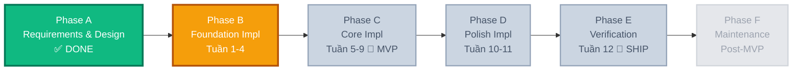
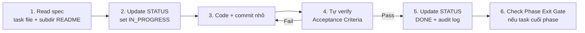

# 📊 STATUS — Waterfall Tracking Dashboard

> **Vai trò**: file live duy nhất theo dõi tiến độ dự án theo mô hình **Waterfall**. Cập nhật sau mỗi phase/task hoàn thành. Không xóa entry cũ — chỉ append.

> Từ thời điểm này, `STATUS.md` track theo **execution phase trong `todo/`**. Task ID trong `planning/docs/TASK_INDEX.md` vẫn dùng để tra cứu spec gốc, nhưng không còn là trục chính để điều phối thực thi hàng ngày.

📍 Hôm nay: `2026-05-20` · Canon rule base: `planning/` · Canon execution order: `todo/` · Phase hiện tại: **Phase B — Foundation Implementation** ⏳

---

## 🌊 Waterfall Phases

Dự án chia **6 phase tuần tự**. Phase trước phải đạt **Exit Gate** (toàn bộ ✅) mới được mở Phase sau. KHÔNG quay ngược trừ khi exit gate fail.



---

## 📈 Tổng quan tiến độ

```text
Phase A — Requirements & Design        [████████████████████] 100%  ✅ Đóng
Phase B — Foundation Impl  (W1-4)      [███░░░░░░░░░░░░░░░░░]  18%  🔵 Đang làm
Phase C — Core Impl       (W5-9)      [░░░░░░░░░░░░░░░░░░░░]   0%  ⏸ Khóa (chờ B)
Phase D — Polish Impl     (W10-11)    [░░░░░░░░░░░░░░░░░░░░]   0%  ⏸ Khóa
Phase E — Verification    (W12)       [░░░░░░░░░░░░░░░░░░░░]   0%  ⏸ Khóa
Phase F — Maintenance     (post-MVP)  [░░░░░░░░░░░░░░░░░░░░]   0%  ⏸ Backlog
─────────────────────────────────────────────────────────────────────────
TỔNG (Phase B-E, execution files)      [██░░░░░░░░░░░░░░░░░░]   7%  (2/29 done, 1 in progress)
```

---

## ✅ Phase A — Requirements & Design (ĐÓNG)

**Mục tiêu**: chốt yêu cầu nghiệp vụ + thiết kế kiến trúc TRƯỚC khi gõ code.

### Exit Gate ✅

- [x] BRD viết xong → [`REQUIREMENTS.md`](./REQUIREMENTS.md)
- [x] Glossary domain đầy đủ → [`CONTEXT.md`](./CONTEXT.md)
- [x] 28 design decisions critical đã lock → CONTEXT.md
- [x] Convention code đầy đủ §1–§15 → [`../setup/CONVENTIONS.md`](../setup/CONVENTIONS.md)
- [x] Database schema thiết kế xong → [`../setup/DATABASE_SCHEMA.md`](../setup/DATABASE_SCHEMA.md)
- [x] API contracts outline cho mỗi bounded context → `business/<context>/README.md`
- [x] Roadmap 12 tuần → [`ROADMAP.md`](./ROADMAP.md)
- [x] Per-subdir README có invariants + DoD

### Deliverables

| Artifact | File | Status |
|----------|------|--------|
| BRD | `docs/REQUIREMENTS.md` | ✅ |
| Glossary + Decisions | `docs/CONTEXT.md` | ✅ |
| Code Convention | `setup/CONVENTIONS.md` | ✅ |
| DB Schema | `setup/DATABASE_SCHEMA.md` | ✅ |
| Roadmap | `docs/ROADMAP.md` | ✅ |
| Task Specs | 79 task files | ✅ |
| Charters | 1 (Identity) + 1 (Revenue) | ✅ |

**Đóng phase A**: 2026-05-19 — duyệt bởi: cá nhân (self-learn).

---

## ⏳ Phase B — Foundation Implementation (HIỆN TẠI)

**Mục tiêu**: build nền tảng kỹ thuật (NestJS + DB + Auth). Hết Phase B → có thể đăng ký + đăng nhập user.

**Phạm vi**: Tuần 1–4 (ROADMAP). Execution checklist chính nằm ở `todo/phase-b/`.

### Entry Gate (đã mở 🟢)

- [x] Phase A đóng
- [x] **Tools setup (Tuần 0) DONE** — repo đã có `package.json`, `node_modules/`, lint/test/build scripts
- [x] Repo init + first commit — git repo đã tồn tại và đang được dùng

### Exit Gate (đóng phase khi ✅ tất cả)

- [ ] `npm run start:dev` chạy, log `Nest application successfully started`
- [ ] `GET /health/live` trả 200 khi app sống; `GET /health/ready` (terminus) trả 200 khi DB connected
- [ ] `POST /api/v1/auth/register` + `POST /api/v1/auth/login` chạy thật, trả access+refresh token
- [ ] `GET /api/v1/me` với Bearer token trả user info, không có `password`
- [ ] `POST /api/v1/auth/refresh` rotate token, **detect reuse → kill family**
- [ ] `PATCH /api/v1/users/me/change-password` revoke all token families
- [ ] User table có `id (UUID), email, password (bcrypt), role, deletedAt, createdAt, updatedAt`
- [ ] Address table có N per User + `isDefault` (max 1 constraint)
- [ ] Migration system hoạt động: tạo migration sai → revert OK
- [ ] Seed script chạy: 1 admin user + 3 demo address
- [ ] Global ValidationPipe + GlobalExceptionFilter → error response schema chuẩn
- [ ] Lint pass + build pass

### Execution tracker (`todo/phase-b/`)

| Task file | Status | Note |
|------|:------:|------|
| `todo/phase-b/00-tools-setup.md` | ⏳ | toolchain máy local không thể xác nhận chỉ từ repo; cần verify thủ công |
| `todo/phase-b/01-nestjs-scaffold.md` | 🔵 | app scaffold + `/health` cơ bản + prefix + aliases đã có; structure target chưa hội tụ đủ |
| `todo/phase-b/02-env-config.md` | ✅ | `ConfigModule` + schema validation + config factory đã khớp task |
| `todo/phase-b/02b-swagger.md` | ✅ | Swagger bootstrap + `addBearerAuth()` + port qua `ConfigService` đã khớp task |
| `todo/phase-b/03-docker-postgres.md` → `15-phase-b-exit-gate.md` | ⏳ | canonical execution chain |

**Tổng ước**: ~32 giờ ≈ 4 tuần × 8h.

**Status legend**: ⏳ Not started · 🔵 In progress · ⏸ Blocked · ✅ Done · ❌ Cancelled

> Ghi chú: từ bản cập nhật này, progress ở đây phản ánh **execution files trong `planning/todo/`**, không dùng mẫu số `35 task` cũ của roadmap/spec tổng hợp.
> Verify snapshot 2026-05-21: `npx tsc --noEmit` pass; `npm run build` đang fail vì Windows lock/permission trên file trong `dist/`, nên chưa thể coi code quality gate là pass.

---

## ⏸ Phase C — Core Implementation (KHÓA — chờ Phase B)

**Mục tiêu**: build core revenue flow. **Hết Phase C = MVP demo-able**.

**Phạm vi**: Tuần 5–9. Execution checklist chính nằm ở `todo/phase-c/`.

### Entry Gate

- [ ] Phase B đóng (tất cả exit gate ✅)

### Exit Gate

- [ ] User browse `GET /api/v1/products` với pagination + text search
- [ ] Admin/STAFF tạo/sửa/xóa Category, Product
- [ ] User add/update/remove cart items (Guest qua cookie `gsid`, User qua JWT)
- [ ] Cart Merge khi Guest login → tạo `mergeWarnings[]` đúng spec
- [ ] `POST /api/v1/orders` với `Idempotency-Key` header → tạo Order PENDING + trừ stock atomic
- [ ] Order state machine reject transition sai
- [ ] Admin force-status endpoint log vào `OrderStateChangeLog`
- [ ] Cleanup job 15-min cancel Order PENDING + hoàn stock
- [ ] VNPay IPN/return verify HMAC + idempotent qua `providerTxId`
- [ ] Payment SUCCESS đổi Order PENDING → PAID atomic
- [ ] Test thủ công full flow: register → browse → cart → checkout → pay

### Execution tracker (`todo/phase-c/`)

| Task file | Status | Note |
|------|:------:|------|
| `todo/phase-c/01-catalog-schema.md` | ⏳ | schema |
| `todo/phase-c/02-catalog-crud.md` | ⏳ | catalog CRUD |
| `todo/phase-c/03-cart.md` | ⏳ | cart + guest merge |
| `todo/phase-c/04-order.md` | ⏳ | checkout + state machine |
| `todo/phase-c/05-payment.md` | ⏳ | VNPay |
| `todo/phase-c/06-phase-c-exit-gate.md` | ⏳ | MVP gate |

🎯 **Tuần 8 milestone**: MVP demo-ready (chưa polish, chưa test).

---

## ⏸ Phase D — Polish Implementation (KHÓA)

**Mục tiêu**: hoàn thiện DX/UX để pre-production.

**Phạm vi**: Tuần 10–11. Execution checklist chính nằm ở `todo/phase-d/`.

### Entry Gate

- [ ] Phase C đóng

### Exit Gate

- [ ] Mọi exception trả response theo schema chuẩn (statusCode/code/message/errors/timestamp/path/requestId)
- [ ] Request log có correlation ID + duration
- [ ] Swagger UI ở `/docs` hiển thị mọi endpoint + DTO + response example
- [ ] JSON success responses theo envelope chuẩn; `204 No Content` không bị wrap sai
- [ ] Email verification flow chạy thật (Mailtrap dev)
- [ ] Forgot password flow chạy thật (one-time token, expiry 1h)
- [ ] Account recovery tokens chỉ lưu hash, không lưu raw token

### Execution tracker (`todo/phase-d/`)

| Task file | Status | Note |
|------|:------:|------|
| `todo/phase-d/01-error-logging.md` | ⏳ | filter + logging + response transform |
| `todo/phase-d/02-swagger.md` | ⏳ | `/docs` |
| `todo/phase-d/03-account-recovery.md` | ⏳ | verify + reset |
| `todo/phase-d/04-phase-d-exit-gate.md` | ⏳ | polish gate |

---

## ⏸ Phase E — Verification (KHÓA — SHIP gate)

**Mục tiêu**: chứng minh MVP đạt yêu cầu nghiệp vụ. **Hết Phase E = SHIP.**

**Phạm vi**: Tuần 12. Execution checklist chính nằm ở `todo/phase-e/`.

### Entry Gate

- [ ] Phase D đóng

### Exit Gate (SHIP gate — strictest)

- [ ] Unit test ≥ 60% coverage trên service layer
- [ ] Unit test cover 100% branches của `CartService.calculate()`, `OrderService.checkout()`
- [ ] E2E test full flow happy path (register → login → browse → cart → order → pay → status)
- [ ] E2E test edge cases: stock insufficient, idempotency replay, token reuse, cart merge conflicts
- [ ] `npm run build` pass, `npm run lint` pass, 0 critical warnings
- [ ] Manual UAT: chạy demo end-to-end với 1 reviewer (hoặc tự review checklist)
- [ ] README.md project có badge build + coverage
- [ ] CHANGELOG ghi MVP release với commit hash

### Execution tracker (`todo/phase-e/`)

| Task file | Status | Note |
|------|:------:|------|
| `todo/phase-e/01-testing.md` | ⏳ | unit + e2e + verification |
| `todo/phase-e/02-ship.md` | ⏳ | release / ship gate |

🚀 **Tuần 12 milestone**: SHIP — repo tag `v1.0.0`.

---

## ⏸ Phase F — Maintenance / Post-MVP (BACKLOG)

**Mục tiêu**: feature mở rộng + scale infra **chỉ làm khi gặp triệu chứng**.

**Phạm vi**: tự chọn từ:
- `business/06-engagement/` (Coupons, Reviews, Wishlist, ...)
- `business/07-future/` (Loyalty, ML, Social Login, ...)
- `setup/05-scale-infra/` (Cache, RBAC, K8s, ...)

### Exit Gate

Không có — phase này mở vô thời hạn. Mỗi feature thêm vào tự có sub-exit-gate riêng.

---

## 📅 Daily Audit Log

> **Quy tắc**: mỗi lần ngồi xuống code, ghi 1 entry. Append-only, không sửa entry cũ. Định dạng:
> `[YYYY-MM-DD HH:MM] [PhaseX] [TaskID/topic] [Status change] [Note ngắn]`

```
[2026-05-19 18:00] [Phase A] [meta]              [DONE] Phase A đóng. 79 task spec + glossary + decisions locked.
[2026-05-19 18:00] [Phase B] [meta]              [OPEN] Phase B mở. Bắt đầu Tuần 0 setup tools.
[2026-05-21 00:00] [Phase B] [doc-audit]         [UPDATE] Đồng bộ lại tracker với repo thật: scaffold/env-config/Swagger bootstrap đang in progress; Docker/Prisma/Auth chưa bắt đầu.
[2026-05-21 00:10] [Phase B] [verify]            [UPDATE] `npx tsc --noEmit` pass. `npm run build` fail do `EPERM` khi ghi/xóa file trong `dist/`, chưa kết luận là lỗi code.
[2026-05-21 00:20] [Phase B] [task-02/02b]       [UPDATE] `ConfigModule` đã load typed config factories; `main.ts` dùng `ConfigService` cho port. Nâng Task 02 và 02b lên DONE.
```

<!-- Thêm entry mới phía dưới. KHÔNG xóa entry cũ. -->

---

## 🎯 Next 3 Actions (cập nhật mỗi session)

1. **Cài tools Tuần 0** — Node 20 + Docker Desktop + DBeaver + VSCode extensions (ESLint/Prettier/Prisma/REST Client).
2. **Init repo** — `npm init nest`, `git init`, commit "chore: scaffold NestJS".
3. **Task `01-bootstrap-nestjs`** — đọc spec ở `setup/01-project/01-bootstrap-nestjs.md`, code theo Acceptance Criteria, verify `GET /health` 200.

---

## 🔄 Workflow per task (waterfall mini-loop)



---

## 🚨 Phase Exit Sign-off Template

Khi đóng 1 phase, ghi entry audit log + ký:

```
[YYYY-MM-DD HH:MM] [Phase X] [EXIT GATE]
- ✅ Criterion 1: <evidence/commit hash>
- ✅ Criterion 2: <evidence>
- ...
Signed-off: <self> · Next: Phase Y open.
```

---

## 📐 Quy tắc waterfall áp dụng

| Quy tắc | Cụ thể |
|---------|--------|
| **No phase skip** | Không bỏ qua phase nào. Phase A → B → C → D → E tuần tự. |
| **Exit gate cứng** | Mọi checkbox ✅ → mới đóng phase. Thiếu 1 → không đóng. |
| **Append-only audit** | Daily Audit Log không xóa, chỉ append. Sai → ghi entry sửa, không xóa entry cũ. |
| **Phase F là exception** | Maintenance không có exit. Tự do chọn task. |
| **Re-entry hiếm** | Nếu sau Phase E phát hiện bug Phase B → ghi audit "Re-open Phase B for HOTFIX-X", fix, đóng lại. KHÔNG silent skip. |

---

## 🔗 Liên hệ

- ROADMAP chi tiết tuần: [`ROADMAP.md`](./ROADMAP.md)
- Spec task: [`TASK_INDEX.md`](./TASK_INDEX.md) → click task file tương ứng
- Decisions: [`CONTEXT.md`](./CONTEXT.md)
- Convention code: [`../setup/CONVENTIONS.md`](../setup/CONVENTIONS.md)
